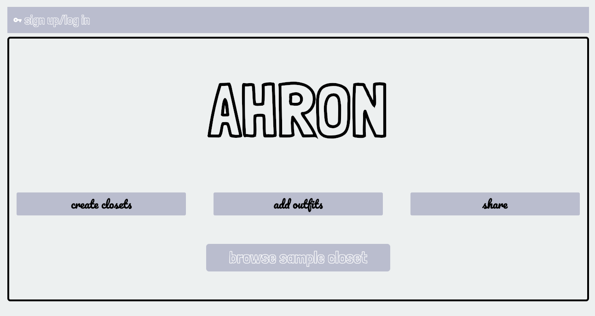
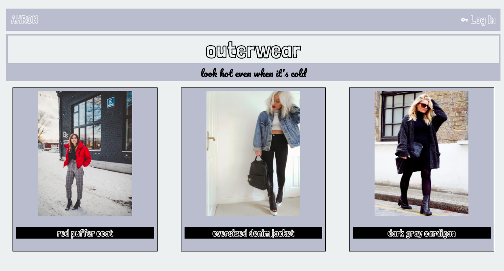
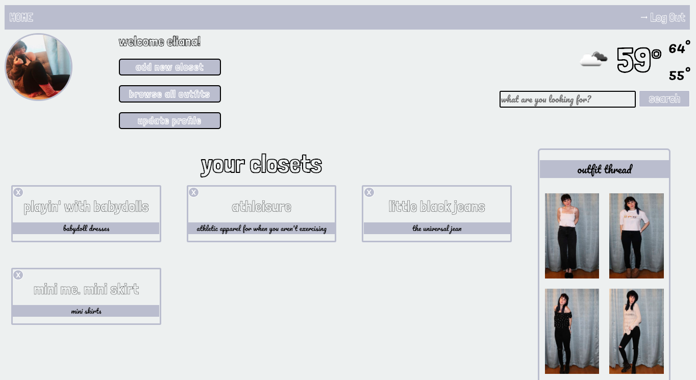
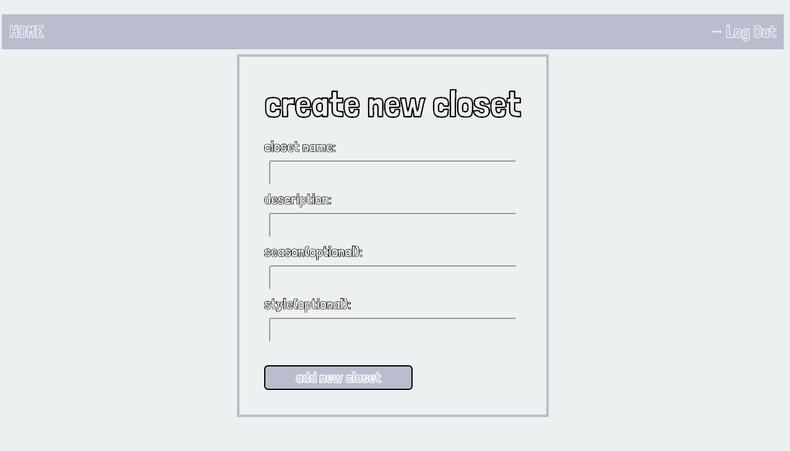
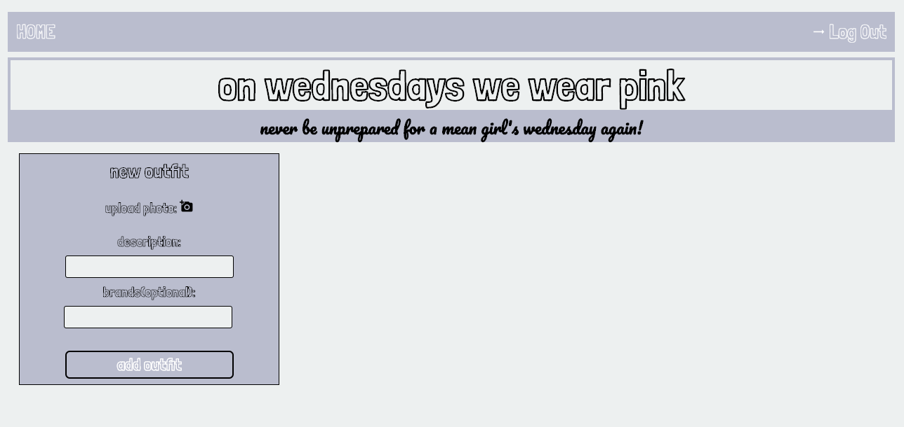
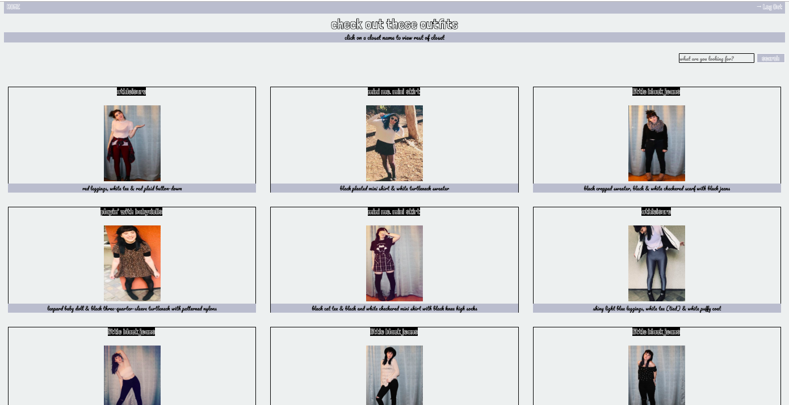

# AHRON
## ABOUT AHRON
Welcome to AHRON, a digital, shareable closet for all of your favorite outfits! Whether it's a quick selfie of your #ootd or a photoshoot to show off your personal style, AHRON is the social media app for you! 

#### Landing Page

#### Browse a sample closet

#### Your personal profile page 

#### Create a new closet

#### Add an outfit to your closet

#### Browse a feed of all the outfits

## TECHNOLOGIES USED

Node.js, Express, MongoDB, Mongoose, EJS, OpenWeatherMap.org API

## CHECK OUT THE APP

https://ahron.herokuapp.com <- access the app and start creating closets today!

https://trello.com/b/zJKBuzpq/ahron <- check out wireframes & upcoming potential features on Trello! 

## ICEBOX FEATURES

* Like button
* Ability to follow other users/view their profile
* Responsive design (esp for mobile)
* Integration with online shopping // fashion brands
* Integration with tech like Amazon Look to automatically upload photos to the app
* Closet index feature to upload images of individual clothing items 
* Outfit creator feature to put individual clothing items together to plan your outfit
